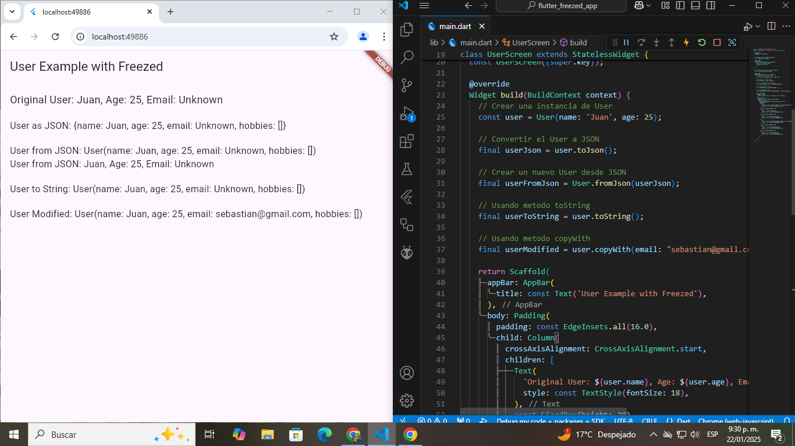

# 🚀 Flutter Freezed Example Project

[](https://flutter.dev)

[](LICENSE)



## 📚 Descripción

Este proyecto es una demostración de cómo usar la biblioteca **Freezed** en Flutter para crear modelos inmutables, serializables y fáciles de manipular. **Freezed** es una poderosa librería que ayuda a reducir el boilerplate en el código, proporcionando características como la comparación de objetos, la clonación con copyWith, y la conversión de objetos a JSON y Map.

## 🎯 Objetivo del Proyecto

- Aprender a usar **Freezed** para crear clases inmutables en Flutter.
- Experimentar con serialización y deserialización de objetos usando `toJson()` y `fromJson()`.
- Implementar validaciones con la anotación `@Assert` en las clases.
- Practicar el uso de métodos como `copyWith`, `toString`.

## 🛠️ Características

- **Modelos Inmutables**: Usando Freezed para crear clases inmutables con facilidad.
- **Validación de Campos**: Implementación de validaciones con la anotación `@Assert`.
- **Serialización/Deserialización**: Convertir objetos a JSON con los métodos `toJson()` y `fromJson()`.
- **Métodos Útiles**: Uso de `copyWith` y `toString` 

## 📂 Estructura del Proyecto

```plaintext
lib/
├── main.dart           # Punto de entrada de la app
├── user.dart           # Definición del modelo User con Freezed
```

## 🚀 Cómo Ejecutar el Proyecto

1. Asegúrate de tener Flutter instalado en tu sistema. Si no, sigue las instrucciones en la [documentación oficial](https://flutter.dev/)

2. Clona este repositorio:

```bash
git clone https://github.com/BastianNaitsab/flutter_freezed_exercise
```

3. Navega al directorio:

```bash
cd flutter_freezed_exercise
```

4. Instala las dependencias:

```bash
flutter pub get
```

5. Genera el código de Freezed:

Freezed utiliza generadores de código para crear las implementaciones necesarias, como los métodos `toJson()`, `fromJson()`, `copyWith()`, entre otros. Para generar este código, ejecuta el siguiente comando:

```bash
flutter pub run build_runner build
```

6. Ejecuta la aplicación:

```bash
flutter run
```

## 🧰 Herramientas Usadas

- **Flutter SDK:** Framework
- **Dart:** Lenguaje de Programacion
- **VS Code:** Entorno de Desarrollo
- **Freezed:** Librería para crear clases inmutables y serializables


## 📖 Lo que He Aprendido

- 🌟 Freezed simplifica el trabajo con modelos inmutables y serializables en Flutter.
- 🌟 Usar validaciones con `@Assert` para asegurarse de que los objetos sean válidos al momento de su creación.
- 🌟 La conversión entre objetos, JSON y Map es mucho más sencilla utilizando Freezed.
- 🌟 La importancia de usar métodos como `copyWith` para modificar objetos inmutables sin crear errores en el código.

## 🤝 Contribuciones

Este proyecto es principalmente para aprendizaje personal, pero siéntete libre de proponer mejoras o sugerencias.

## 📞 Contacto
Bastian Naitsab - [devmentesacontacto@gmail.com](mailto:devmentesacontacto@gmail.com)  
GitHub: [BastianNaitsab](https://github.com/BastianNaitsab)